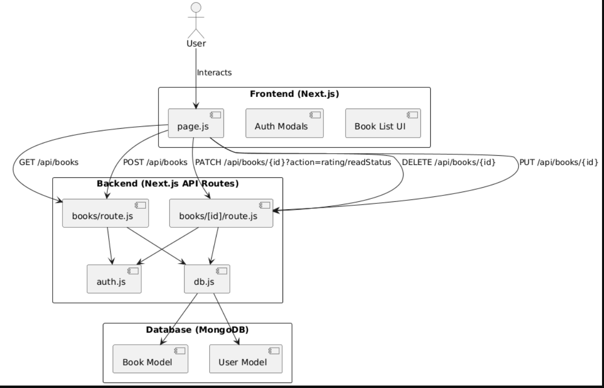

# My Book List App

A full-stack web application built with **Next.js**, **MongoDB**, and **JWT authentication** that allows users to manage their personal library. Users can register, log in, add books, edit details, rate them, toggle read status, and delete entries. The app also supports sorting and filtering for easier navigation.

---

## 🚀 Features

- **Authentication**
  - Register and login with JWT-based authentication
  - Secure routes for adding, editing, rating, and deleting books

- **Book Management**
  - Add new books with metadata (title, author, genre, year, cover image, links, summary)
  - Edit existing book details
  - Delete books
  - Toggle read/unread status
  - Rate books (1–5 stars)

- **Sorting**
  - Sort by title, author, year, rating, read status, and genre

- **UI**
  - Responsive design with modals for login, register, add, edit, and delete
  - Background image and styled components for a clean interface

---

## 🛠️ Tech Stack

- **Frontend:** Next.js (React, TailwindCSS)
- **Backend:** Next.js API routes
- **Database:** MongoDB with Mongoose
- **Auth:** JWT tokens
- **Deployment:** Vercel or Node.js server

---

## 📂 Project Structure

app/ api/ books/ route.js          # GET, POST [id]/route.js     # PUT, PATCH, DELETE lib/ db.js                # MongoDB connection auth.js              # JWT verification models/ Book.js              # Book schema User.js              # User schema page.js                # Main UI page

## ⚙️ Setup

1. Clone the repository:
   ```bash
   git clone https://github.com/yourusername/book-list-app.git
   cd book-list-app

Install dependencies:
npm install

3. 	Configure environment variables in :

MONGODB_URI=mongodb+srv://<user>:<password>@cluster.mongodb.net/booklist
JWT_SECRET=your-secret-key


4. 	Run the development server:

npm run dev

5. 	Open http://localhost:3000 in your browser.

🔒 Authentication
• 	JWT tokens are issued on login and stored in .
• 	Protected routes (, , , ) require .

📊 Future Improvements
• 	Add search functionality
• 	Pagination for large libraries
• 	User-specific book collections
• 	Improved error handling and notifications


UML Diagram:

